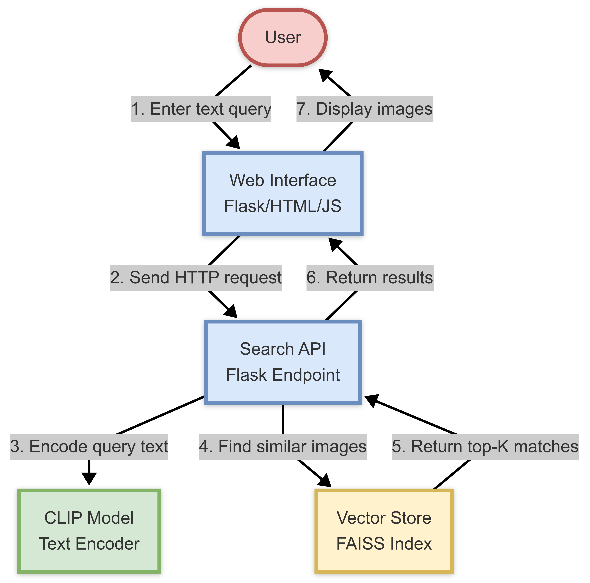
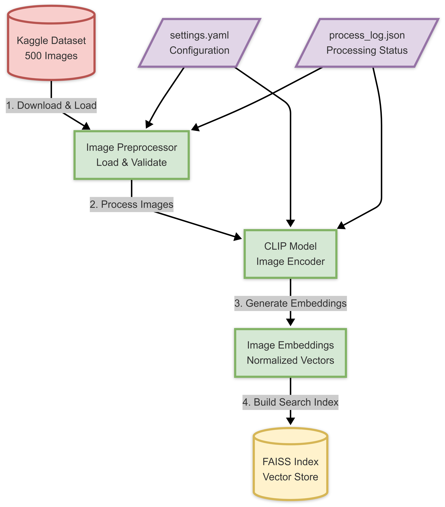

# System Architecture

## Overview
The Multi-Modal Image Retrieval System consists of two main workflows:
1. Runtime Search Flow - Handles user queries and returns matching images
2. Data Processing Pipeline - Prepares and indexes the image dataset

## Runtime Search Flow


The search workflow consists of these steps:
1. User enters a text query in the web interface
2. Web interface sends HTTP request to Flask API
3. API forwards query to CLIP model for text encoding
4. System searches FAISS vector store for similar images
5. Vector store returns top-K matches
6. API returns results to web interface
7. Interface displays matched images to user

Key Components:
- **Web Interface**: Flask/HTML/JS frontend providing search interface
- **Search API**: Flask endpoint handling search requests
- **CLIP Model**: Converts text queries to embeddings
- **Vector Store**: FAISS index storing image embeddings

## Data Processing Pipeline


The data processing workflow:
1. Download and load images from Kaggle dataset
2. Process images through validation and preprocessing
3. Generate image embeddings using CLIP model
4. Build FAISS search index from embeddings

Key Components:
- **Dataset**: 500 test images from Kaggle
- **Image Preprocessor**: Handles image loading and validation
- **CLIP Model**: Generates image embeddings
- **FAISS Index**: Efficient similarity search structure

## Configuration & Logging
The system uses two main configuration components:
- `settings.yaml`: Core configuration settings
- `process_log.json`: Tracks processing status and changes

## Technical Details

### CLIP Integration
```python
class CLIPEncoder(BaseEncoder):
    def __init__(self, model_name: str = "openai/clip-vit-base-patch32"):
        self.model = CLIPModel.from_pretrained(model_name)
        self.processor = CLIPProcessor.from_pretrained(model_name)
```

### Vector Storage
```python
class VectorStore:
    def __init__(self, dimension: int):
        self.index = faiss.IndexFlatL2(dimension)
        self.metadata = {}
```

### Search Implementation
```python
def search(self, query: np.ndarray, k: int = 5):
    distances, indices = self.index.search(query, k)
    metadata = [self.metadata[int(idx)] for idx in indices[0]]
    return distances[0], metadata
```

## Key Design Decisions

1. **CLIP Model Choice**
   - Using CLIP for both text and image encoding
   - Ensures semantic similarity in shared embedding space
   - Base model variant balances performance and resources

2. **Vector Search**
   - FAISS for efficient similarity search
   - L2 normalized vectors for cosine similarity
   - In-memory index for fast retrieval

3. **Web Interface**
   - Flask for lightweight server
   - Simple, accessible frontend
   - RESTful API design

4. **Processing Pipeline**
   - Batch processing for efficiency
   - Process tracking for reliability
   - Modular design for extensibility